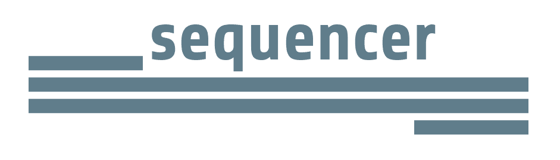

  
  <h3>sequencer is a simple diagramming tool to make it easy for developers to share ideas</h3>
  

    
    
    
    
  

## What is sequencer?
Sequencer allows you to create **simple and clear sequence diagrams**, based on a simple grammar. Your diagram is **drawn in real-time** as you type, and is designed to be:
 - easy to **edit**
 - easy to **share**
 - easy to **version control**

## Simple to get started

#### Describe your sequence
`Client -> Server: Request`

`Server -> Server: Parses request`

`Server -> Service: Query`

`Service -> Server: Data`

`Server -> Client: Response`

#### Your diagram is ready to go

Copy the diagram to your clipboard to paste straight in to chat or email.

See the [wiki](https://github.com/rsouth/sequencer/wiki) for the current grammar.

  

    
  

## Contributing
**Pull requests are welcome**. For major changes, please open an issue first to discuss what you would like to change.

Please make sure to update tests as appropriate.

## Credits / Attributions

#### Icons
Toolbar icons made by [Dave Gandy](https://www.flaticon.com/authors/dave-gandy) from [www.flaticon.com](https://www.flaticon.com/)

Tab close icon made by [Vectors Market](https://www.flaticon.com/authors/vectors-market) from [www.flaticon.com](https://www.flaticon.com/)

#### Inspiration

[WebSequenceDiagrams](https://www.websequencediagrams.com/) which is an online text-based sequence diagram generator with a commercial offering.

## License

This project is licensed under the terms of the GNU General Public License v3.0.

